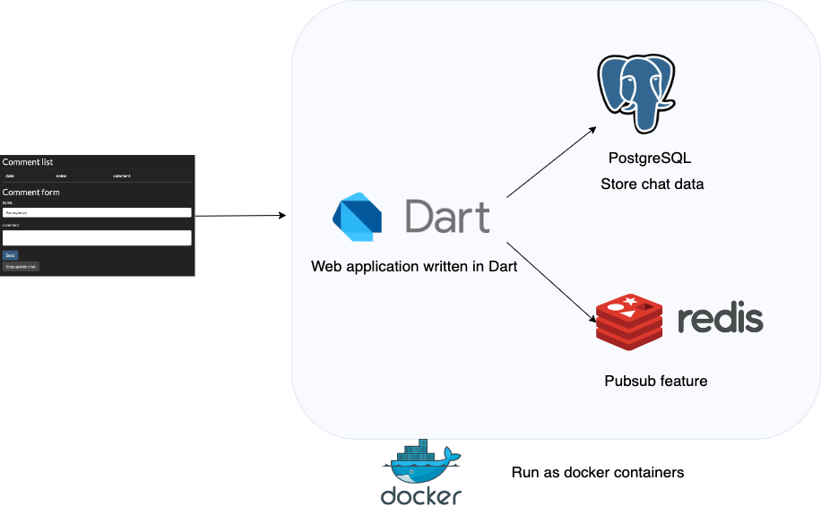

# About

Simple chat server application written with Dart.

*I created this application just to learn Dart programming, so its architecture may not be reasonable.*

This is a chat server application.
The features are explained below.

# Get started

## Prerequisites

* Dart SDK (version >= 2.17.1)

## Development

Get dependencies.
```shell
dart pub get
```

Run builder to generate json serializer codes when you modified the models annoted with json serializer or adding one.
```
dart run build_runner build
```
For details, check https://pub.dev/packages/json_serializable.

Run the app with mock.
```
export MOCK=1
dart --no-sound-null-safety run bin/main.dart
```

For the sample web application, open 'http://127.0.0.1:8080/' with the browser.

The web server uses the following ports by default.
* 8080 (web server serving static files and standard web api)
* 8081 (websocket)

You can change to other ports by setting the following environment variables.
* PORT_WEB
* PORT_WEBSOCKET

# API specification

## REST API

[API specification doc.](./api_specification/doc/generated/api_specification.html)

Generate API specification docs.
```
cd api_specification
npm i
npx redoc-cli build ./doc/api_specification.yml -o ./doc/generated/api_specification.html
```

## WebSocket API

[WebSocket API specification doc.](./api_specification/doc/generated/asyncapi.md)

Generate API specification docs.
```
cd api_specification
npm i
npx ag ./doc/async_api_specification.yml @asyncapi/markdown-template -o doc/generated/ --force-write
```


# Run test codes

```
dart test
```

# Generate Dart docs

Generates the documentations into doc directory.
```
dart doc
```

# The architecture

## The present architecture

The present architecture is the following.


The web server stores the chat data in memory, so they are lost when the web server process restarts.

The pubsub function fully runs on the web server, so it works only for one web server scenario.

## The future architecture

The future architecture is the following.



The PostgreSQL stores the chat data and the Redis provides the pubsub function, and all the system run as the Docker container.

# Directory structure

| Directory  | Contents |
| ------------- | ------------- |
| api_specification  | API documents  |
| architecture  | Architecture documents  |
| bin  | Application start script  |
| doc  | Dart docs  |
| lib  | Application codes  |
| public  | Static files for the web application  |
| test  | Test codes  |
